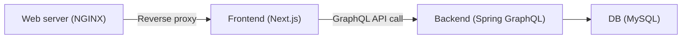

# Pokedex App

This project is for myself to learn about [Next.js](https://nextjs.org/) and [GraphQL](https://graphql.org/).

I've developed the Pokedex for this purpose.

## Screenshots


## System architecture (overview)



## Dependencies

* Frontend
    * NPM >= 8.7.0
    * Node.js >= 12.22.1
    * Next.js >= 12.1.0
    * TypeScript >= 4.5.5
    * Tailwind CSS >= 3.0.24
    * GraphQL
* Backend
    * Spring Boot >= 2.7.0
    * Kotlin >= 1.6.0
    * AdoptOpenJDK >= 11
    * Spring GraphQL >= 1.0.0-SNAPSHOT
* DBMS
    * MySQL >= 8.0
* CI
    * Docker >= 20 / Docker Compose V2 (>= 2.1.1)

## How to run

### 0. (Do it only once) Prepare the Pokemon images

This repo doesn't (won't) contain any Pokemon images. Please download them from somewhere outside this repo.
I created a Python script to do this. Please use it on your own responsibility.

```bash
$ python3 -V

$ cd scripts/extract_data
$ pip install -r requirements.txt
  # Install dependencies

$ python3 extract_data.py
  # Download Pokemon images from Github

$ cp scripts/extract_data/results/images/*.png frontend/public/images/pokemon/
  # Copy all the images to the image directory of the frontend app
```

### 1-a. Run the app with Docker Compose

1. Run the app with Docker Compose
    ```
    $ docker compose version
      # Make sure you installed Docker Compose V2 (not V1)
      # Ref: https://docs.docker.com/compose/
    
    $ scripts/operation/reload-compose.sh
      # Run the containers using Docker Compose
    ```

2. Visit http://localhost:3000/ after every component seems to boot up

### 1-b. Run DEV server

It is a faster set up than 1-a.

1. Run the backend API in your local PC
    
    ```
    $ cd backend
    $ ./gradlew bootRun
    ```
    
2. Run Next.js's DEV server in another terminal
    
    ```
    $ cd frontend
    $ npm run dev
    ```

3. Visit http://localhost:3000/

## Special thanks

* [PokeAPI](https://pokeapi.co/)
* https://github.com/fanzeyi/pokemon.json/tree/master/images